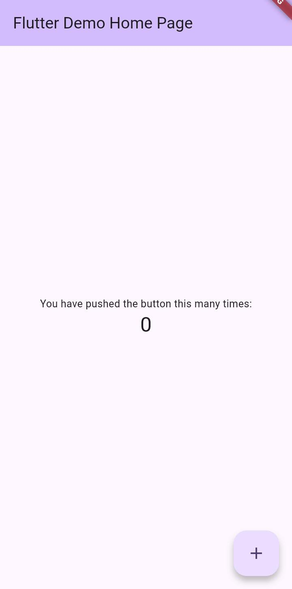
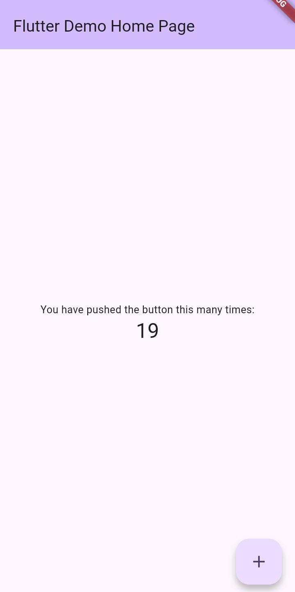

# Laporan Praktikum Modul 01: Mobile Ecosystem, Flutter Setup & Profile App

- **Nama**: Shofi Fitriany Hidayah
- **NIM**: 362558302062
- **Kelas / Prodi**: 2A / D4 Teknologi Rekayasa Perangkat Lunak
- **Mata Kuliah**: Pemrograman Perangkat Bergerak 

---

## 1. Ringkasan Aktivitas
Pada modul ini saya mempelajari cara menggunakan flutter dan melakukan uji coba di Hp saya dan juga emulator yang saya download pada AndroidSDK, saya juga mempelajari sejarah dari flutter mulai dari Native, Hybrid / WebView, hingga Cross-Platform Modern. 3 lapisan yang ada pada flutter Franework(Dart), Engine(c++), Embedder(Platform Level). 
Dalam proses pelaksanaan, terdapat dua kendala utama yang dihadapi, yaitu lokasi Android SDK pada folder pengguna (C:\Users\HYPE 7 AMD X8-1\...) yang mengandung karakter spasi sehingga sistem tidak dapat berjalan normal, serta status perangkat Android yang belum terotorisasi (Not Authorized) akibat izin USB Debugging yang belum aktif. Kendala tersebut berhasil diatasi dengan memindahkan direktori Android SDK ke lokasi baru tanpa spasi (D:\AndroidSDK), serta mengaktifkan Opsi Pengembang (Developer Options) dan menyetujui izin USB Debugging melalui menu pengaturan pada perangkat HP.
## 2. Bukti Tangkapan Layar (Running App)
[Sertakan minimal 2 screenshot bukti aplikasi profil berjalan di emulator atau HP fisik Anda]

## 3. Kendala yang Dihadapi & Solusinya
- **Kendala**: 
- Saat menjalankan flutter doctor ternyata penempatan AndroidSDK pada folder user C:\Users\HYPE 7 AMD X8-1\... memiliki karakter spasi sehingga AndroidSDK tidak dapat berjalan normal pada direktori yang mengandung spasi (ini penyebab masalah utama AndroidSDK tidak bisa berjalan normal) 
- Perangkat Android Belum Diberi Izin (Not Authorized) yang terjadi adalah perangkat HP (JR9D7SUC8PCUFQMN) terhubung ke laptop, tetapi otorisasi USB Debugging belum disetujui. 
- **Solusi**: 
- Solusi nya saya memindahkannya dari folder user C:\Users\HYPE 7 AMD X8-1\... ke D:\AndroidSDK sini.
- Saya mengecek Hp saya di bagian pengaturan ke menu pengaturan tambahan, lalu klik opsi pengembang dan izinkan dengan menggeser opsi pengembang.
## 4. Jawaban Pertanyaan Refleksi
1. **Pilihan Native vs Flutter**: 
- Pilih Native jika: Aplikasi membutuhkan akses hardware secara langsung dengan performa paling maksimal, integrasi mendalam dengan API spesifik OS, atau aplikasi hanya dikembangkan untuk satu platform tunggal.
- Pilih Flutter jika: Membutuhkan efisiensi pengembangan untuk Android dan iOS secara bersamaan dari satu basis kode (single codebase), ingin mempercepat time-to-market, menghemat anggaran tim, serta menginginkan UI/animasi yang konsisten (60–120 FPS) tanpa terhambat JavaScript Bridge.
2. **Prinsip UI = f(state)**: 
- Pendekatan Imperatif: Developer harus memanipulasi elemen UI secara manual satu per satu (misalnya menggunakan 'findViewById()' lalu 'setText()')
- Pendekatan Deklaratif (UI = f(state)): UI dianggap sebagai fungsi (f) dari data/kondisi aplikasi (state). Developer cukup mendeklarasikan struktur UI sesuai dengan state\-nya. Ketika data/state berubah (misalnya melalui 'setState()' atau Riverpod 'ref.watch()'), Flutter secara otomatis merender ulang sub-pohon widget (widget subtree) untuk memperbarui tampilan di layar tanpa manipulasi DOM/XML manual.
3. **Pentingnya Conventional Commits**: 
- Kerja Tim & Review: Memudahkan rekan tim atau penguji untuk melacak riwayat perubahan secara presisi—apakah sebuah commit menambah fitur baru (feat), memperbaiki bug (fix), atau memperbarui dokumentasi (docs).
- Portofolio Profesional: Menunjukkan kedisiplinan software engineering, membuat riwayat proyek terstruktur rapi, serta mempermudah pembuatan changelog atau pemulihan kode (rollback) jika terjadi masalah.